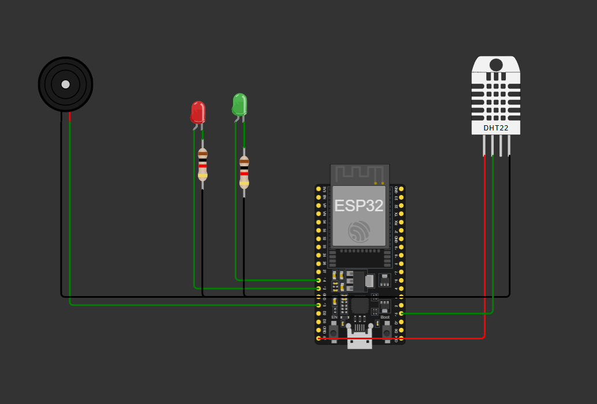

# Smart Baby Room Monitor (IoT-Based Environmental Safety System)

An IoT-based smart home automation solution engineered to continuously track, assess, and report nursery environments. This project monitors ambient temperature and relative humidity using an ESP32 microcontroller and a DHT sensor, generating instant localized sensory alarms while feeding a continuous telemetry log stream to the cloud.

---

## 🔗 Live Project Links

*   **Wokwi Interactive Simulation:** [Launch Simulation Platform](https://wokwi.com/projects/466062129388177409)
*   **ThingSpeak Cloud Analytics:** [View Public Live Channel Dashboard](https://thingspeak.mathworks.com/channels/3402261)

---

## 📺 Project Media Demonstrations

### System Architecture Snapshot



### Live Execution Demonstration
<!-- Drag and drop your mp4 video into your GitHub issue editor to generate a video link or reference it locally -->
https://github.com/YOUR_GITHUB_USERNAME/YOUR_REPO_NAME/assets/demo-video.mp4

---

## 🛠️ System Architecture & Hardware Pinout

The hardware logic layout is fully simulated inside the Wokwi Virtual Environment using the following connection schema:

| Input/Output Component | Hardware Variant | ESP32 GPIO Microprocessor Pin | Functional Role |
| :--- | :--- | :--- | :--- |
| **Environmental Sensor** | DHT22 / DHT11 | `GPIO 15` | Digital Data Bus |
| **Visual Alert Indicator** | Red LED | `GPIO 12` | Unsafe Zone Status |
| **Status Indicator** | Green LED | `GPIO 14` | Safe Zone Status |
| **Acoustic Warning Alarm** | Piezo Buzzer | `GPIO 13` | Frequency Driven Pulse (`1kHz`) |

---

## 🧠 Core Operational Logic

### 1. Environmental Threshold Guardrails
The software actively parses incoming float arrays against certified comfortable baby environment ranges:
*   **Optimal Temperature Boundaries:** $20.0^\circ\text{C} \le \text{Temperature} \le 26.0^\circ\text{C}$
*   **Optimal Relative Humidity Boundaries:** $40.0\% \le \text{Humidity} \le 60.0\%$

### 2. Dual-Layer Fail-Safe Handling
*   **Local Level:** Processing relies on active evaluation scripts. If boundaries fail, loops toggle status LEDs instantly and pass square wave pulses via `tone(BUZZER, 1000)` to resolve static digital signal issues common to simulations.
*   **Cloud Level:** Instead of simple delays, data transfers evaluate time differentials through an asynchronous `millis()` framework. This isolates cloud updates (required every 15 seconds by ThingSpeak's API) from internal system checking frequencies (executing seamlessly every 2 seconds).

---

## 📊 Cloud Telemetry Layout (ThingSpeak)

Data structures map directly into individual data blocks inside your cloud instance:
*   **Field 1:** Ambient Real-Time Temperature ($^\circ\text{C}$)
*   **Field 2:** Relative Air Humidity ($0\text{--}100\%$)
*   **Field 3:** Cumulative Safety Violation Incident Counter

---

## 🚀 How to Run the Project Local Implementation

1. Clone this repository structure:
```bash
   git clone https://github.com/tech-by-niteshh/baby_room_monitoring_system.git
